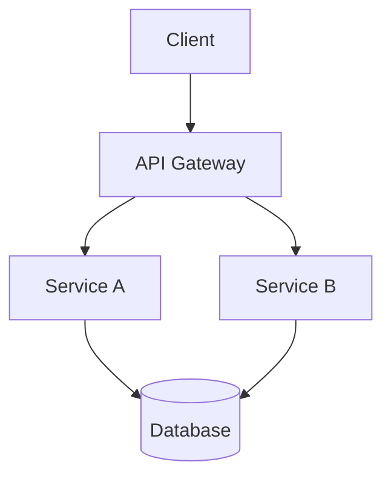
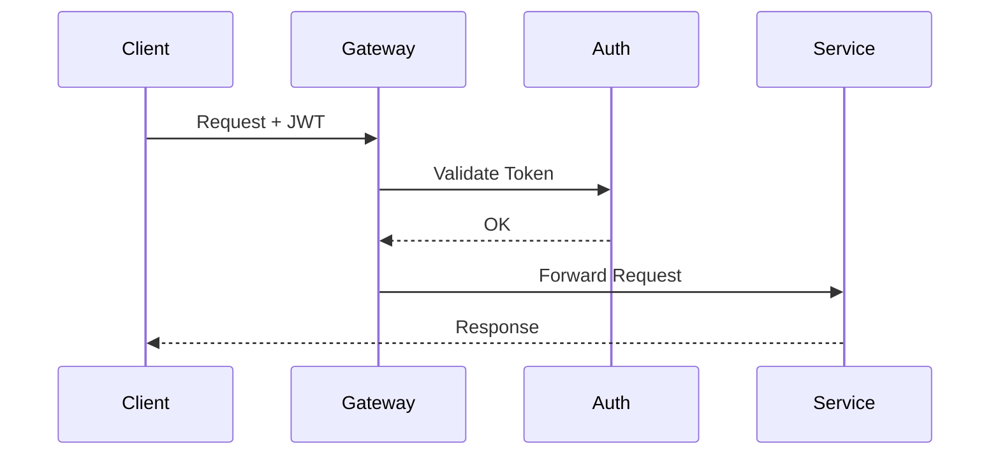

# Architecture — 系統架構文件

| 欄位 | 內容 |
|------|------|
| **專案** | PROJECT_NAME |
| **版本** | v0.1.0 |
| **最後更新** | YYYY-MM-DD |

---

## 系統概覽

> 一段話描述這個系統的核心職責與邊界。

---

## 架構圖

---

## 服務清單

| 服務名稱 | 職責 | 技術棧 | Port |
|----------|------|--------|------|
| api-gateway | 路由、認證 | Kong | 8000 |
| service-a | 業務邏輯 A | Go | 8001 |
| service-b | 業務邏輯 B | Go | 8002 |

---

## 資料流

> 描述核心業務場景的資料流向。

---

## 外部依賴

| 依賴 | 用途 | 版本 | 替代方案 |
|------|------|------|----------|
| PostgreSQL | 主資料庫 | 15 | - |
| Redis | Cache / Session | 7 | - |

---

## 安全邊界

> 描述認證、授權、資料隔離的設計。

---

## 已知技術債

- [ ] （列出已知的設計缺陷與計畫解決時間）

---

## 關聯 ADR

- ADR-001：初始技術棧選型
